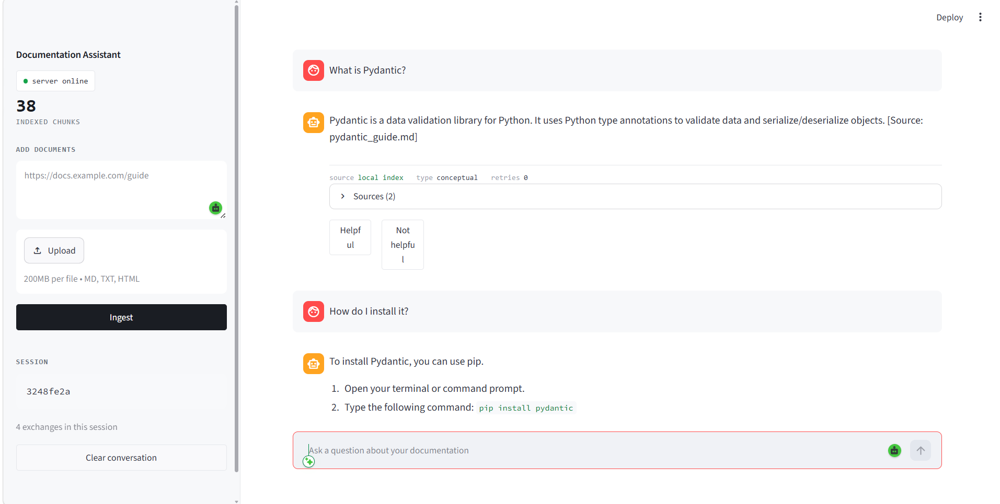
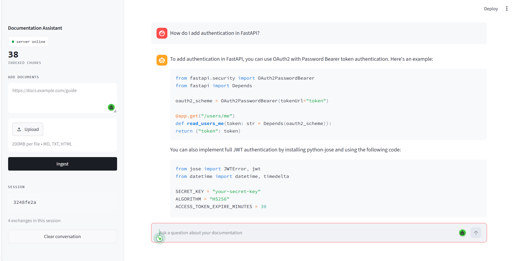
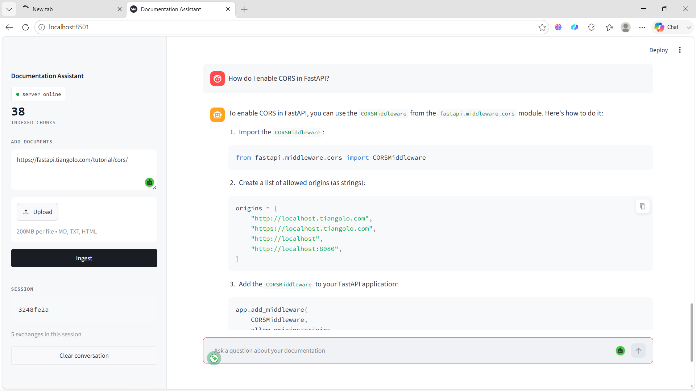

# RAG Technical Documentation Assistant

A self-corrective Retrieval-Augmented Generation (RAG) system built with LangGraph, FastAPI, and Groq. The system retrieves relevant chunks from a vector store, grades them for relevance, generates a grounded answer with citations, verifies the answer against the source material, and falls back to web search when local documentation has no answer.

---

## Contents

- [Overview](#overview)
- [Architecture](#architecture)
- [Pipeline Walkthrough](#pipeline-walkthrough)
- [Features](#features)
- [Tech Stack](#tech-stack)
- [Setup](#setup)
- [Running the Application](#running-the-application)
- [API Reference](#api-reference)
- [Interface](#interface)
- [Project Structure](#project-structure)
- [Design Decisions and Tradeoffs](#design-decisions-and-tradeoffs)
- [Chunking and Embedding Strategy](#chunking-and-embedding-strategy)
- [Assumptions](#assumptions)
- [Improvements With More Time](#improvements-with-more-time)
- [Document Corpus](#document-corpus)

---

## Overview

A user submits a natural language question. The system rewrites and classifies the query, retrieves the most relevant chunks from ChromaDB, grades each chunk for relevance using an LLM, and generates an answer strictly from the relevant chunks with source citations. A final node verifies the answer is grounded in the retrieved material. If no relevant local documents are found after retries, the system falls back to a live web search before generating an answer.

The system also maintains per-session conversation history, so follow-up questions ("How do I install it?") are resolved using prior context.

---

## Architecture

```
                              ┌────────────────────┐
                              │   User Question    │
                              └─────────┬──────────┘
                                        │
                                        ▼
                          ┌─────────────────────────────  ─┐
                          │ Node 1 — Query Analysis         │
                          │ • Classify query type           │
                          │ • Rewrite for retrieval         │
                          │ • Resolve follow-ups via history│
                          └─────────────┬────────────────┘
                                        │
                                        ▼
                          ┌──────────────────────────────┐
                          │ Node 2 — Retrieval              │
                          │ • ChromaDB similarity search    │
                          │ • Adaptive top-k by query type  │
                          └─────────────┬────────────────┘
                                        │
                                        ▼
                          ┌──────────────────────────────┐
                          │ Node 3 — Document Grading    │
                          │ • LLM grades each chunk      │
                          │ • Filters irrelevant chunks  │
                          └─────────────┬────────────────┘
                                        │
                    ┌───────────────────┼────────────────────┐
                    │                   │                    │
            relevant chunks      no chunks, retry        retries exhausted
                    │             < MAX_RETRIES                │
                    │                   │                    │
                    │                   ▼                    ▼
                    │        ┌────────────────────┐  ┌────────────────────┐
                    │        │ Rewrite query      │  │ Node — Web Search  │
                    │        │ and re-retrieve    │  │ (Tavily fallback)  │
                    │        └─────────┬──────────┘  └─────────┬──────────┘
                    │                  │                        │
                    │                  └──────────┬─────────────┘
                    │                             │
                    ▼                             ▼
          ┌──────────────────────────────────────────────┐
          │ Node 4 — Generation                          │
          │ • Answer strictly from graded chunks         │
          │ • Source citations included                  │
          │ • Format adapts to query type                │
          └─────────────────────┬────────────────────────┘
                                │
                                ▼
          ┌──────────────────────────────────────────────┐
          │ Node 5 — Hallucination Check                 │
          │ • Verifies answer is grounded in chunks      │
          │ • Regenerates if not (capped at 2 attempts)  │
          └─────────────────────┬────────────────────────┘
                                │
                                ▼
                       ┌─────────────────┐
                       │  Final Answer     │
                       │  + Sources        │
                       └─────────────────┘
```

---

## Pipeline Walkthrough

| Step | Node | Responsibility |
|---|---|---|
| 1 | Query Analysis | Classifies the question into `how-to`, `conceptual`, `troubleshooting`, `api-reference`, or `general`. Rewrites the query for better retrieval and resolves pronouns or follow-ups using conversation history. |
| 2 | Retrieval | Runs a similarity search against ChromaDB. Top-k varies by query type (7 for how-to, 6 for troubleshooting, 4 for conceptual, 5 default). |
| 3 | Document Grading | An LLM grades each retrieved chunk as relevant or irrelevant to the question. Irrelevant chunks are dropped. |
| Conditional | Routing | If relevant chunks remain, proceed to generation. If none remain and retries are available, rewrite the query and retry retrieval. If retries are exhausted, fall back to web search. |
| Fallback | Web Search | Queries Tavily for live web results and converts them into the same document format used by the generation node. |
| 4 | Generation | Produces the final answer using only the graded chunks (or web results), with inline source citations. Output format adapts to the query type — numbered steps for how-to, explanations for conceptual questions, and so on. |
| 5 | Hallucination Check | An LLM checks whether the generated answer is supported by the source chunks. If not, the answer is regenerated, capped at two attempts to avoid infinite loops. |

### State Schema

The LangGraph state object tracks everything that flows between nodes:

```python
class GraphState(TypedDict):
    question: str
    rewritten_query: str
    query_type: Literal["how-to", "conceptual", "troubleshooting", "api-reference", "general"]
    retrieved_docs: List[Document]
    graded_docs: List[Document]
    generation: str
    retry_count: int
    regen_count: int
    hallucination_flag: bool
    sources: List[str]
    error: Optional[str]
    chat_history: List[dict]
    web_search_used: bool
```

`retry_count` tracks retrieval retries (capped by `MAX_RETRIES`, default 3). `regen_count` tracks hallucination-driven regenerations (capped at 2). Both caps exist to guarantee the graph terminates.

---

## Features

- Self-corrective retrieval loop with query rewriting on failed retrieval
- LLM-based document relevance grading
- Hallucination check with bounded regeneration (Self-RAG inspired)
- Web search fallback via Tavily when local documentation has no answer
- Per-session conversation memory for follow-up questions
- Adaptive top-k retrieval based on query classification
- Streamlit chat interface with source citations and feedback capture
- FastAPI backend with full Swagger documentation

---

## Tech Stack

| Component | Technology |
|---|---|
| Workflow orchestration | LangGraph |
| LLM | Groq — llama-3.1-8b-instant |
| Embeddings | SentenceTransformers — all-MiniLM-L6-v2 |
| Vector store | ChromaDB |
| Web search fallback | Tavily |
| API framework | FastAPI |
| Frontend | Streamlit |
| Language | Python 3.11+ |

---

## Setup

### 1. Clone the repository

```bash
git clone https://github.com/Tharun-Design/rag_doc.git
cd rag_doc
```

### 2. Create a virtual environment

```bash
python -m venv .venv

# Windows
.venv\Scripts\activate

# macOS / Linux
source .venv/bin/activate
```

### 3. Install dependencies

```bash
pip install -r requirements.txt
pip install tavily-python streamlit
```

### 4. Configure environment variables

Copy the example file and fill in your keys:

```bash
cp .env.example .env
```

```env
# LLM
GROQ_API_KEY=your_groq_api_key_here
LLM_MODEL=llama-3.1-8b-instant
LLM_TEMPERATURE=0.2

# Embeddings
EMBEDDING_MODEL=all-MiniLM-L6-v2
TRANSFORMERS_OFFLINE=1

# Vector store
CHROMA_PERSIST_DIR=./data/chroma_db
CHROMA_COLLECTION_NAME=rag_documents

# Chunking
CHUNK_SIZE=500
CHUNK_OVERLAP=50

# Retrieval
TOP_K_DEFAULT=5
TOP_K_HOWTO=7
TOP_K_CONCEPTUAL=4
TOP_K_TROUBLESHOOTING=6
MAX_RETRIES=3

# Web search fallback
TAVILY_API_KEY=your_tavily_api_key_here
```

API keys (both have free tiers):

- Groq — https://console.groq.com
- Tavily — https://app.tavily.com

### 5. Ingest the document corpus

```bash
python ingest_docs.py
```

---

## Running the Application

Two processes run side by side.

**Terminal 1 — API server**

```bash
python main.py
```

**Terminal 2 — Chat interface**

```bash
streamlit run streamlit_app.py
```

| Service | URL |
|---|---|
| API | http://localhost:8000 |
| Swagger documentation | http://localhost:8000/docs |
| Chat interface | http://localhost:8501 |

---

## API Reference

### POST /query

Submits a question and returns an answer with sources and pipeline metadata.

```bash
curl -X POST http://localhost:8000/query \
  -H "Content-Type: application/json" \
  -d '{"question": "How do I add authentication in FastAPI?", "session_id": "demo"}'
```

```json
{
  "question": "How do I add authentication in FastAPI?",
  "answer": "To add authentication in FastAPI, you can use OAuth2 with Password Bearer token authentication...",
  "sources": ["fastapi_basics.md"],
  "query_type": "how-to",
  "retry_count": 0,
  "hallucination_checked": true,
  "web_search_used": false,
  "session_id": "demo",
  "error": null
}
```

### POST /ingest

Ingests new documents from URLs or file uploads.

```bash
curl -X POST http://localhost:8000/ingest \
  -F "urls=https://fastapi.tiangolo.com/tutorial/cors/"
```

```bash
curl -X POST http://localhost:8000/ingest \
  -F "files=@docs/new_guide.md"
```

```json
{
  "status": "success",
  "chunks_added": 3,
  "sources": ["https://fastapi.tiangolo.com/tutorial/cors/"]
}
```

### GET /documents

Lists all indexed chunks with source and preview.

```bash
curl http://localhost:8000/documents
```

```json
{
  "total_documents": 38,
  "documents": [
    {
      "id": "9a938371d01d908a",
      "source": "fastapi_basics.md",
      "content_preview": "# FastAPI Documentation ...",
      "chunk_index": 0
    }
  ]
}
```

### POST /feedback

Records thumbs up or down feedback for an answer.

```bash
curl -X POST http://localhost:8000/feedback \
  -H "Content-Type: application/json" \
  -d '{"question": "What is Pydantic?", "answer": "...", "rating": "thumbs_up"}'
```

```json
{ "status": "recorded", "rating": "thumbs_up" }
```

### GET /memory/{session_id}

Returns the conversation history for a session.

```bash
curl http://localhost:8000/memory/demo
```

### DELETE /memory/{session_id}

Clears the conversation history for a session.

```bash
curl -X DELETE http://localhost:8000/memory/demo
```

---

## Interface

The Streamlit interface presents a chat window with a pipeline trace beneath each answer, showing the answer source (local index or web search), the classified query type, and the number of retrieval retries.

**Conceptual question with citation and**
**Follow-up question resolved via conversation memory**

The second question, "How do I install it?", is resolved against the prior question about Pydantic using session chat history.




**How-to question with code generation**



**Newly ingested documentation answered from local index**

After ingesting the FastAPI CORS tutorial page through the sidebar, the same content becomes available to the retrieval pipeline.



---

## Project Structure

```
rag_doc/
├── main.py                              FastAPI application entry point
├── streamlit_app.py                     Streamlit chat interface
├── ingest_docs.py                       Document ingestion script
├── requirements.txt
├── .env.example                         Environment variable template
├── app/
│   ├── config.py                        Configuration loaded from .env
│   ├── memory.py                        In-memory conversation store
│   ├── workflow.py                      LangGraph workflow definition
│   ├── models/
│   │   ├── state.py                     LangGraph state schema
│   │   └── schemas.py                   Pydantic request/response models
│   ├── nodes/
│   │   ├── node_query_analysis.py       Node 1 — classify and rewrite query
│   │   ├── node_retrieval.py            Node 2 — ChromaDB similarity search
│   │   ├── node_document_grading.py     Node 3 — relevance grading
│   │   ├── node_generation.py           Node 4 — answer generation
│   │   ├── node_hallucination_check.py  Node 5 — groundedness check
│   │   └── node_web_search.py           Web search fallback (Tavily)
│   └── utils/
│       ├── ingestion.py                 Document loading and chunking
│       └── vector_store.py              ChromaDB wrapper
├── docs/
│   ├── fastapi_basics.md
│   ├── pydantic_guide.md
│   ├── langchain_guide.md
│   └── screenshots/
└── data/
    └── chroma_db/                       Persisted vector store
```

---

## Design Decisions and Tradeoffs

**Chunking strategy.** Documents are split in two passes. The first pass splits on Markdown headers, so each chunk retains its section heading and surrounding context. The second pass applies a `RecursiveCharacterTextSplitter` to any section that still exceeds the configured chunk size (500 characters, 50 character overlap). This keeps code blocks and explanations together more often than naive fixed-width splitting.

**Embedding model.** `all-MiniLM-L6-v2` runs locally on CPU with no API cost or network dependency, and produces good quality embeddings for English technical text. This was preferred over hosted embedding APIs for cost and latency reasons during development.

**LLM choice.** Groq's `llama-3.1-8b-instant` was chosen for its very high throughput (roughly 560 tokens per second) and free-tier token allowance. The pipeline issues three to five LLM calls per query (analysis, grading, generation, hallucination check, occasional regeneration), so a fast, lightweight model keeps both latency and token usage manageable.

**Conversation memory.** Implemented as an in-memory Python dictionary keyed by session ID rather than a database. This is sufficient for local development and demo use, where the server process persists for the duration of a session. It does not survive a server restart.

**Bounded retries and regenerations.** Both the retrieval retry loop and the hallucination-driven regeneration loop have hard caps (`MAX_RETRIES=3` and a regeneration cap of 2). Without these caps, a question the corpus genuinely cannot answer well could cause the hallucination check to repeatedly reject the answer, looping indefinitely. The caps guarantee termination while still allowing the self-corrective behavior to run.

**Multiple LLM calls per query.** Grading each chunk individually and checking for hallucinations separately from generation produces more reliable results than a single combined call, at the cost of higher latency and token usage per query. For this assignment's scale, the quality improvement was judged worth the cost.

---

## Chunking and Embedding Strategy

1. Load source documents from local files or fetched URLs.
2. Split on Markdown headers first, so each resulting chunk corresponds to a logical section with its heading intact.
3. For any section exceeding `CHUNK_SIZE` (500 characters), apply `RecursiveCharacterTextSplitter` with `CHUNK_OVERLAP` (50 characters) to preserve continuity across the split boundary.
4. Generate embeddings for each chunk with `all-MiniLM-L6-v2`.
5. Store embeddings and metadata (source, chunk index) in ChromaDB, using a content hash as the chunk ID so re-ingesting the same content does not create duplicates.

This approach was chosen because technical documentation is naturally organized by headings, and keeping a chunk's heading attached to its body text gives the generation step more context about what each chunk is describing.

---

## Assumptions

- The corpus is small enough (tens to low hundreds of chunks) that per-chunk LLM grading is practical. A much larger corpus would need batched grading.
- A single LLM provider (Groq) is sufficient for all four LLM-driven nodes; no fallback provider is configured.
- Conversation memory is scoped to a single server process and a single session ID, with no persistence requirement.
- Web search fallback is only needed when the local corpus has no relevant chunks after all retries, not as a primary source.

---

## Improvements With More Time

- Batch document grading into a single LLM call per query instead of one call per chunk, to reduce latency and token usage.
- Replace the in-memory conversation store with SQLite or Redis for persistence across restarts.
- Add PDF ingestion support using `pdfplumber` or similar.
- Replace the simple string-prepending query rewrite with an LLM-based rewrite that considers why the previous retrieval failed.
- Stream generation tokens to the Streamlit interface for faster perceived response time.
- Add an evaluation harness using RAGAS-style metrics (faithfulness, answer relevance, context recall) to track pipeline quality over time as the corpus or prompts change.

---

## Document Corpus

The sample corpus consists of three Markdown documents:

- `fastapi_basics.md` — routing, request and response models, authentication, middleware, dependency injection
- `pydantic_guide.md` — model definition, field validation, serialization, nested models
- `langchain_guide.md` — chains, retrievers, memory, prompt templates

Additional documents can be added at any time through the `/ingest` endpoint or the sidebar of the chat interface, by URL or file upload.
